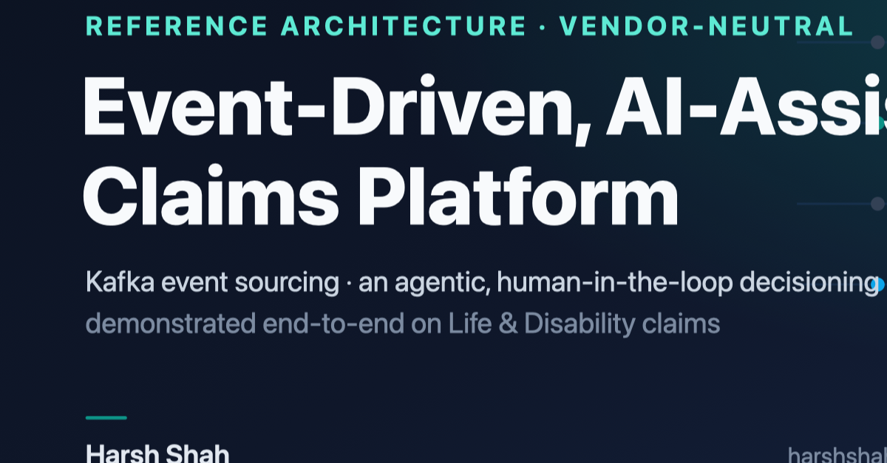

# Event-Driven, AI-Assisted Claims Platform
### A reference architecture for Life & Disability claims — and how to add AI without losing the audit trail

> **How to use this file**
> - **Hero image:** upload `hero-image.png` (1200×627) as the LinkedIn article cover.
> - **Article body:** paste everything below the "ARTICLE" line into LinkedIn's article editor.
> - **Teaser post:** use the short "LINKEDIN POST" block to share it.
> - Live reference architecture: **https://harshshah85.github.io/insurance-claims-platform/**
> - More of my work: **https://harshshah85.github.io/about-me/**

---

## LINKEDIN POST (the share that links the article)

A lot of "AI in claims" projects bolt a model onto a system that overwrites its own history. Then, six months later, nobody can explain a denial.

So I built the opposite. It's a vendor-neutral reference architecture for a Life & Disability claims platform where the event log is the system of record, and the AI is an advisory layer sitting on top. The agents do the reading and reasoning. Humans make the call.

It's fully written up and live — 12 docs covering the event backbone, the agentic decisioning layer, security and regulation, money movement, resilience, and the cost model. The white paper below is the short version.

🔗 https://harshshah85.github.io/insurance-claims-platform/

#EventDriven #Kafka #SoftwareArchitecture #InsurTech #AI #EventSourcing

---

# ARTICLE

## A hard job with an unforgiving audience

Claims is a deceptively hard domain. You're moving money to people on the worst day of their lives, using their most sensitive data, under rules that change by state and charge you interest for being late.

And you're really doing two different jobs at once.

A **life (death) claim** comes from a beneficiary — often someone who isn't in your systems at all and may not know the policy number. It pays once. The hard part is the front door: proving who they are, working out who's entitled, confirming the death, and finding the right policy.

A **disability-income claim** comes from the policyholder, who is already a known, logged-in customer. It pays a benefit every month. The hard part is the long tail: recertification, return-to-work, income offsets, on and on.

Most modernization efforts follow the same script. A CRUD system that overwrites rows. An audit table bolted on the side that slowly drifts from the truth. And lately, an AI model wired on top that can produce an answer but not a reason you'd want to defend. That's fine in a demo. It falls apart in a market-conduct exam.

This is a reference architecture for doing it the other way around.

## Make the event the record

The core decision is simple to state. Store each claim as the ordered list of events that happened to it — notified, policy resolved, requirement satisfied, scored, decided, paid — and treat that log as the source of truth. Everything you look at on a screen is a projection built by replaying it. That's event sourcing with CQRS, running on Apache Kafka.

Two things follow immediately.

First, you get a complete, tamper-evident history for free. When a regulator asks to see every action on a claim, in order, with the person who took each one, the log *is* the answer. You're not stitching it back together from a dozen tables and some application logs.

Second, your read models become disposable. A bug in a projection isn't a data-fix emergency. You redeploy the corrected projector, replay the log, and the view rebuilds itself. Nothing in production got patched by hand.

On top of that backbone go the things that make it a claims platform. A straight-through-processing score (STP) that auto-tickets the clean, low-risk claims with no human involved. A separate fraud score that acts as a hard gate, so a suspicious claim never auto-pays no matter how clean it otherwise looks. And a saga for money movement, because a disbursement crosses your platform, a treasury system, and a bank — three systems no single transaction should ever try to wrap. The saga makes each step its own observable, reversible stage instead.

## Add AI without handing over the keys

This is where I think most designs get the governance backwards. The instinct is to let the model decide. The discipline is to let it reason, and keep humans deciding.

So the AI is a third decision layer, sitting above the two that were already there: the deterministic guardrails, and the rules-and-ML scoring. A supervisor orchestrator runs once per claim and fans out to specialist agents — intake and triage, document intelligence, policy and coverage, decisioning, a fraud copilot, correspondence. Each one is scoped to a context it already serves. They read the documents, reconcile the facts across them, and hand a human a decision packet: a recommendation, the evidence it's based on, the reasoning per factor, and a confidence score.

The important part is what they *can't* do.

Every claim still runs the full deterministic pipeline. The AI doesn't get to skip a check. It produces proposed findings, not authority — a human reviews and approves on the assisted path, and the clean auto-ticket lane stays rule-decided. A denial is never the model's alone; it has to cite a coded reason mapped to a policy provision, signed by a human. And every AI output is itself an event, stamped with the model version, the inputs it saw, and its confidence. So for any claim you can answer the only question that matters in an audit: what did the AI suggest, and who actually decided?

There's a quieter benefit too. Because the agents reason off the committed log without writing back to it, a slow or broken model just degrades the assist. It can't corrupt or block a claim's real history.

Does it get better over time? Yes — but through a flywheel, not a leap. Every human decision is also a label. The confirmations and corrections land next to the agent's recommendation, and that becomes the training data for the next model and the test set for the next agent version, gated by an offline evaluation before anything ships and rolled out shadow-then-canary. More labels make the recommendations sharper. They do not quietly hand the model more authority. Moving a class of claims from "recommend" to "decide" is a deliberate, governed step you take on purpose, once the evidence is there — never something that happens because a metric looked good.

## The parts most diagrams skip

Anyone can draw boxes and arrows. The credibility is in the three problems that usually get left off the slide.

**Don't compact your system of record.** Kafka has log compaction, which keeps only the latest value per key. That's exactly right for a latest-state topic like a policy snapshot. It's quietly fatal for an event log, because it throws away the history that event sourcing exists to keep. So the rule is firm: the event log and the audit streams use long retention on tiered storage and are never compacted; compaction is reserved for latest-state topics. (I'll admit I had this wrong in my own first draft and caught it on review. It's an easy mistake to make.)

**The right to be forgotten, on a log you never delete from.** Privacy law says a human can ask to be erased. Event sourcing says the log is append-only. Those look impossible to reconcile until you stop trying to erase the log. The trick is crypto-shredding: encrypt each person's data under a key that's unique to them, and when they ask to be erased, destroy the key. The events stay exactly where they are, with the same ordering and the same hash chain, but the personal data inside them is now unreadable. You've honored the erasure and kept a tamper-evident record, because you acted on the key, not the log.

**Getting a half-finished payment back.** Picture a region failing over mid-disbursement. Because the saga keeps its state as events, recovery is just replay: the orchestrator rehydrates each in-flight payment and picks up exactly where it stopped. Idempotency keys mean a retried step is a no-op at the bank, so nobody gets paid twice. The same properties that make this platform auditable — state in the log, recovery by replay, effects that are safe to retry — are what make it recoverable. You get that second benefit for free once you've committed to the first.

## Why it pays for itself

The business case isn't exotic, and it compounds.

The biggest lever is auto-ticketing the clean claims, and it grows as the low-touch path widens. Faster cycle time shows up immediately, even before any real automation, and it directly cuts the statutory interest you owe on late payments. You lose less to fraud, because scoring and routing catch more of it, and on DI you apply offsets and catch return-to-work before you overpay. And everything stays defensible, because every decision — human or automated — is explainable. That last one is worth more than it looks, right up until the first time a regulator asks.

One honest note from the cost model: at realistic volumes, the infrastructure isn't the expensive part. The build is. The Kafka run-rate is modest next to the engineering effort, which means cost control is mostly about scope discipline. Ship one claim type end to end, prove the cycle-time win on real claims, and the case for going further makes itself.

## What this actually is

It's a vendor-neutral reference architecture. Open patterns only — event sourcing, CQRS, saga, outbox, change-data-capture, Avro with a schema registry — and no product logos. I used Life & Disability as the worked example on purpose, because the specifics (contestability, beneficiary identity, recertification, regulated money movement) are what keep a design honest instead of abstract.

It's all written up and live: the L1/L2 diagrams, the event-streaming backbone, the domain model, decisioning and fraud, the AI-assisted layer, security and regulatory compliance, correspondence and money movement, observability, resilience and disaster recovery, the cost model, the decision records, and a glossary.

**The whole thing is here:** https://harshshah85.github.io/insurance-claims-platform/

---

*I'm [Harsh Shah](https://harshshah85.github.io/about-me/). I design event-driven and AI-assisted platforms for regulated domains. This one is a humanal build, done on my own time, and I'd genuinely like to hear where people who've shipped claims, payments, or event-sourced systems at scale would push back. What would you change?*
